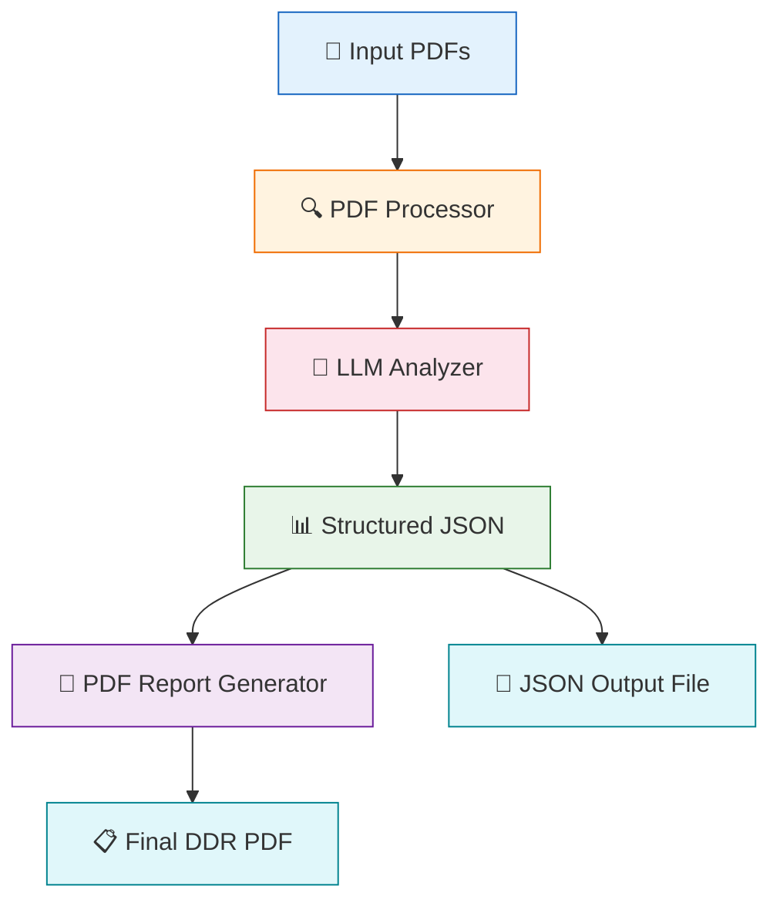
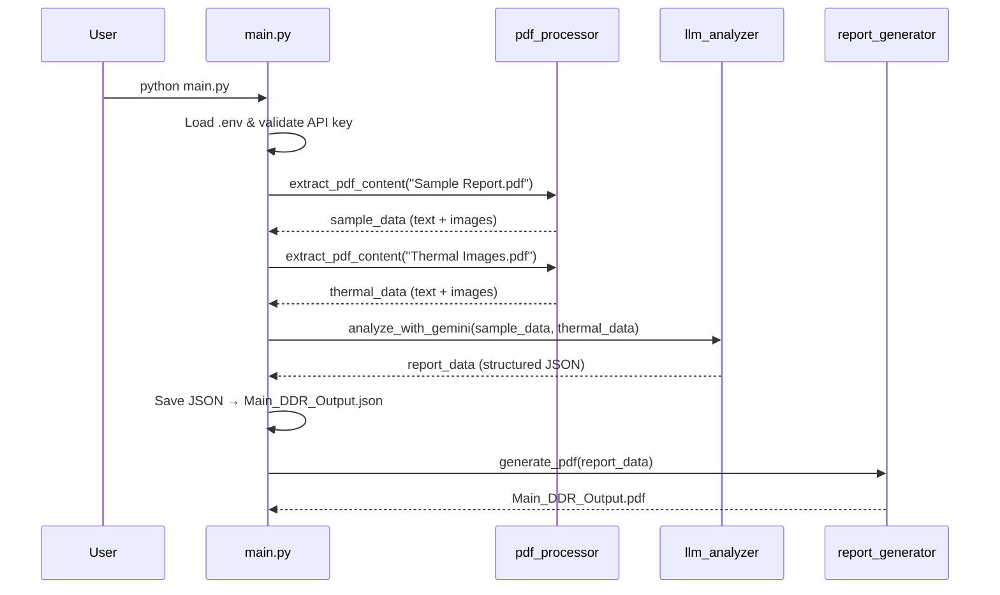
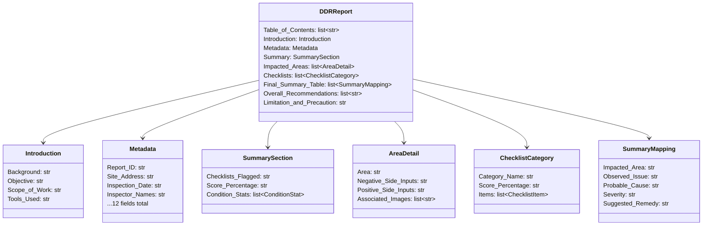

# DDR Report Generator — Project Architecture

## Overview

This project automates the generation of **Detailed Diagnostic Reports (DDR)** for building inspections. It takes raw PDF inspection reports as input, uses AI to extract and structure the data, and produces a professional PDF report + JSON output.

---

## High-Level Architecture



---

## Step-by-Step Pipeline

### Step 1: Environment Setup

| Component | Details |
|---|---|
| **File** | `.env` |
| **Purpose** | Stores the `GEMINI_API_KEY` for authenticating with Google's Gemini API |
| **Dependencies** | `python-dotenv` loads it automatically |

```
GEMINI_API_KEY=your_actual_api_key_here
```

---

### Step 2: Orchestrator (`main.py`)

The entry point that coordinates the entire pipeline.



**Key Steps in `main.py`:**
1. Load environment variables (API key validation)
2. Extract content from both PDFs
3. Send extracted data to Gemini for AI analysis
4. Save structured JSON output
5. Generate the final PDF report

---

### Step 3: PDF Content Extraction (`pdf_processor.py`)

| Detail | Value |
|---|---|
| **Library** | PyMuPDF (`fitz`) |
| **Input** | Raw PDF files (Sample Report + Thermal Images) |
| **Output** | List of dicts with `page`, `text`, and `images` per page |

**Processing Logic:**
```
For each page in PDF:
  1. Extract text using page.get_text("text")
  2. Extract all embedded images using page.get_images()
  3. Filter out tiny images (< 150px) to skip icons/lines
  4. Save valid images to extracted_images/ directory
  5. Return: { page: N, text: "...", images: ["path1", "path2"] }
```

**Image Naming Convention:**
```
{doc_type}_page{N}_img{M}.{ext}
  ↓           ↓       ↓     ↓
sample/    page     image   jpeg/
thermal    number   index   png
```

---

### Step 4: AI-Powered Analysis (`llm_analyzer.py`)

This is the core intelligence module with 3 sub-components:

#### 4A. Pydantic Schema (Data Contract)

Defines the exact JSON structure the LLM must follow:



#### 4B. Input Assembly

The extracted text + image filenames are assembled into a structured prompt:

```
=== INSPECTION REPORT (Sample Report) ===
  -- Page 1 -- [text] [Sample Images: file1, file2]
  -- Page 2 -- [text] [Sample Images: file3, file4]

=== THERMAL REPORT ===
  -- Page 1 -- [text] [Thermal Images: file1, file2]

=== IMAGE INVENTORY ===
  Sample Images grouped by page:
    page3: sample_page3_img1.png, sample_page3_img2.jpeg, ...
    page4: sample_page4_img1.png, ...
```

#### 4C. Post-Processing (`_separate_images`)

After the LLM returns data, images are separated **in code** (not by the LLM):

```python
# Code-level separation based on filename prefix
for each area in Impacted_Areas:
    Normal_Images  ← images starting with "sample_"
    Thermal_Images ← images starting with "thermal_"
```

#### 4D. Retry Logic

Uses `tenacity` library for automatic retries with exponential backoff:
- **Max attempts:** 5
- **Wait:** 4s → 8s → 16s → 30s (exponential, capped at 30s)

---

### Step 5: PDF Report Generation (`report_generator.py`)

| Detail | Value |
|---|---|
| **Library** | FPDF2 |
| **Input** | Structured JSON (from Step 4) |
| **Output** | Professional multi-page PDF |

**PDF Sections Rendered:**

```mermaid
flowchart LR
    subgraph Page1["Page 1"]
        TOC["📑 Table of Contents"]
        INTRO["📝 Introduction"]
    end
    subgraph Page2["Page 2"]
        META["📋 Metadata Table"]
        STATS["📊 Summary Stats"]
    end
    subgraph Pages3to5["Pages 3-5"]
        CHECK["✅ Checklists"]
    end
    subgraph Pages6to50["Pages 6-50+"]
        AREAS["🏠 Area Observations"]
        IMGS["🖼️ Images (2-up grid)"]
    end
    subgraph LastPages["Final Pages"]
        TABLE["📊 Summary Table"]
        RECS["💡 Recommendations"]
    end

    Page1 --> Page2 --> Pages3to5 --> Pages6to50 --> LastPages
```



**Color Coding System:**
| Element | Color | Meaning |
|---|---|---|
| 🟢 Green | `rgb(76,175,80)` | Good / No issue |
| 🟠 Orange | `rgb(255,152,0)` | Moderate |
| 🔴 Red | `rgb(244,67,54)` | Poor / High severity |
| 🔴 Dark Red | `rgb(190,10,30)` | Yes (issue present) |
| ⬜ Grey | `rgb(180,180,180)` | N/A / Not Available |

---

## Project File Structure

```
assignment_/
├── .env                    # API key configuration
├── main.py                 # 🎯 Orchestrator (entry point)
├── pdf_processor.py        # 📄 PDF text/image extraction
├── llm_analyzer.py         # 🧠 Gemini AI analysis + schema
├── report_generator.py     # 📝 PDF report rendering
├── requirements.txt        # Python dependencies
├── Sample Report.pdf       # 📥 Input: Inspection report
├── Thermal Images.pdf      # 📥 Input: Thermal camera images
├── extracted_images/       # 📂 Extracted images (auto-generated)
├── Main_DDR_Output.json    # 📤 Output: Structured JSON
└── Main_DDR_Output.pdf     # 📤 Output: Final DDR PDF
```

---

## Dependencies

| Package | Version | Purpose |
|---|---|---|
| `PyMuPDF` | 1.27.2 | PDF text & image extraction |
| `google-genai` | 1.68.0 | Gemini API client |
| `pydantic` | 2.12.5 | JSON schema validation |
| `fpdf2` | 2.8.7 | PDF generation |
| `python-dotenv` | 1.2.2 | Environment variable loading |
| `tenacity` | 9.1.4 | Retry logic with backoff |
| `pillow` | 12.1.1 | Image processing support |

---

## How to Run

```bash
# 1. Setup
python -m venv venv
.\venv\Scripts\activate        # Windows
pip install -r requirements.txt

# 2. Configure API Key
echo GEMINI_API_KEY=your_key > .env

# 3. Place input PDFs in project root
#    - Sample Report.pdf
#    - Thermal Images.pdf

# 4. Run
python main.py

# 5. Outputs
#    → Main_DDR_Output.json  (structured data)
#    → Main_DDR_Output.pdf   (professional report)
```
